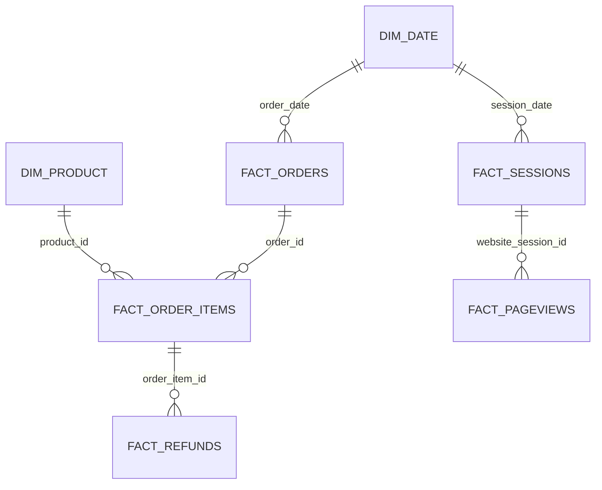

# 🧸 SmartToys Ecommerce Profitability & Customer Journey Analytics

[VIEW THE LIVE DASHBOARD](https://app.powerbi.com/view?r=eyJrIjoiODMzN2ZmYjgtNWU3Yi00YjA5LTg4YmItM2E5MDMyOTUyNDYxIiwidCI6IjM3MGZiM2I4LTMzMDYtNDg5MC05MDYzLWNjMDhiZTc4ODI1NyIsImMiOjEwfQ%3D%3D)

**End-to-end analytics project · Python · Google BigQuery · Power BI**

  

SmartToys is a fictional plush-toy ecommerce business. This end-to-end project brings six transaction and website datasets through a **Raw → Staging → Mart → Power BI** pipeline to answer a management question:

> **Where should the ecommerce team focus across products, traffic, the purchase journey, and customer groups to improve gross profitability and customer experience over the following 12 months?**

The analysis covers website sessions and orders from **19 March 2012 to 19 March 2015**. Recorded refunds extend to **1 April 2015**. The results describe this historical dataset; the proposed actions are experiments to run with current data, not outcomes already achieved.

> **Core decision:** Diagnose mobile funnel friction and product refund exposure first; test merchandising and retention ideas against incremental gross profit after refunds, not basket size or traffic volume alone.

| 472,871 | 32,313 | $1.94M | $85.34K |
| ---: | ---: | ---: | ---: |
| Website sessions | Orders | Gross revenue | Recorded refunds |

## 📑 Table of contents

- [Business context and objectives](#-business-context-and-objectives)
- [Business requirements](#-business-requirements)
- [Data scope](##-🗂️-data-scope)
- [Data processing with Python and BigQuery](#-data-processing-with-python-and-bigquery)
- [Data model and metric definitions](#-data-model-and-metric-definitions)
- [Descriptive analysis](#-descriptive-analysis)
- [Power BI report](#-power-bi-report)
- [Diagnostic insights](#-diagnostic-insights)
- [Recommendations and experiment plan](#-recommendations-and-experiment-plan)
- [Reproduction and repository layout](#-reproduction-and-repository-layout)
- [Limitations](#-limitations)
- [Author](#-author)

## 🧭 Business context and objectives

The business needs to distinguish **sales growth from profitable growth**. High-volume products can create substantial refund losses, large multi-item baskets do not automatically prove that product recommendations work, and a high-traffic source may still bring sessions that struggle to convert on mobile.

This project has four objectives:

1. Monitor orders, revenue, COGS, recorded refunds, and gross profitability at the right transaction grain.
2. Identify products with the greatest absolute contribution and the greatest refund exposure.
3. Locate source, device, and funnel-stage differences that warrant investigation.
4. Measure observed repeat purchasing and frame controlled tests for improving the next purchase.

**Decision principle:** Prioritise opportunities by business impact and testability. Historical correlations indicate *where to investigate*; they do not establish the incremental effect of a new UX change, bundle, or retention campaign.

## 📋 Business requirements

| Question from stakeholders | Analysis delivered |
| --- | --- |
| Is the business growing profitably? | Revenue trend, order volume, AOV, COGS, refunds, gross profit before and after recorded refunds. |
| Which products deserve attention? | Product-level revenue, margin after refunds, refund amount and item refund rate. |
| Is cross-sell a credible opportunity? | Single- versus multi-item order performance and directional product-pair confidence/lift. |
| Which visitors convert? | Sessions and order conversion by mapped traffic source and device. |
| Where do sessions drop out? | Ordered landing → product → cart → shipping → billing → thank-you funnel, with stage and device comparison. |
| Do customers return to buy? | Unique buyers, repeat orders, orders per buyer, and monthly acquisition-cohort table. |

## 🗂️ Data scope

| Source CSV | Grain | Role in analysis |
| --- | --- | --- |
| `products.csv` | One product | Product names, launch dates, and attributes. |
| `website_sessions.csv` | One website session | Device, traffic-source evidence, and session date. |
| `website_pageviews.csv` | One pageview | URL and page sequence within a session. |
| `orders.csv` | One order | Order value, COGS, buyer, and originating session. |
| `order_items.csv` | One purchased item | Product-level revenue, cost, and basket composition. |
| `order_item_refunds.csv` | One refund event | Refunded item, amount, and refund timestamp. |

The dataset contains **40,025 purchased items**, **31,696 distinct buyers**, and **1,731 refund records**. These are different grains; joining them without first aggregating to the required level can multiply revenue or refund totals.

## 🧹 Data processing with Python and BigQuery

The workflow separates preserved source data, cleaned reusable tables, and report-ready tables. **Python performs the transformations; BigQuery stores each layer; Power BI reads the mart.**

| Stage | Dataset / tool | Input → output | Why it exists |
| --- | --- | --- | --- |
| Data understanding | Python notebook | Six CSVs → profiles and quality findings | Inspect schema, keys, nulls, duplicates, date ranges, numeric distributions, and cross-table consistency. |
| Raw ingestion | `jda-k1.bigproject_phap_raw` | Six CSVs → six Raw tables | Retain source columns and values for traceability. |
| Cleaning | `jda-k1.bigproject_phap_staging` | Raw tables → six cleaned tables | Standardise types and source labels while preserving row grain and original IDs. |
| Mart build | `jda-k1.bigproject_phap_mart` | Staging → six renamed entities + `dim_date` | Supply stable reporting grains and a common calendar. |
| Reporting | Power BI | Seven mart tables → semantic model and report | Define measures, filters, and visuals for business decisions. |

### 📓 Project notebooks

The screenshots show two notebook filenames exactly and a third name only partially. The table describes their **place in the documented workflow**; their individual cells must be reviewed before publishing a cell-by-cell technical runbook.

| Notebook | Role in the project | Repository treatment |
| --- | --- | --- |
| Data understanding and processing notebook | Source exploration, quality assessment, and cleaning decisions. | Its filename is truncated in the screenshot. `00_data_understanding_and_processing.ipynb` is a **suggested GitHub name**, not a verified existing name. |
| `01_run_pipeline.ipynb` | Pipeline notebook associated with the Raw → Staging process. | Keep this displayed filename when uploading; document the actual execution cells and inputs after inspecting the notebook. |
| `02_build_mart.ipynb` | Notebook associated with creating reporting tables from cleaned data. | Keep this displayed filename; document its actual output tables and run order after inspecting the notebook. |

The intended manual sequence is **data understanding → `01_run_pipeline.ipynb` → `02_build_mart.ipynb` → Power BI refresh**. Notebook availability does not imply a scheduled job, monitoring, or automatic refresh.

### 🥉 Layer 1 — Raw ingestion

The six source CSVs are loaded to **`jda-k1.bigproject_phap_raw`**. Raw retains the source entities (`products`, `website_sessions`, `website_pageviews`, `orders`, `order_items`, `order_item_refunds`) and source IDs; cleaning and business remapping belong downstream. A useful intake check compares source and loaded row counts, column names and types, primary-ID distinct counts, and minimum/maximum `created_at`.

### 🥈 Layer 2 — Staging and data quality

Python reads the Raw tables, applies the project's cleaning rules, and writes reusable tables to **`jda-k1.bigproject_phap_staging`**. Validation is performed at the source-table grain before joining tables:

| Source | Important checks / handling | Business risk controlled |
| --- | --- | --- |
| `orders` | Unique `order_id`; usable timestamps and numeric `price_usd` / `cogs_usd`; inspect high-end price and COGS values rather than dropping them solely for exceeding an IQR threshold. | Incorrect revenue and cost totals. |
| `order_items` | Unique `order_item_id`; valid `order_id` and `product_id`; item-level prices and costs stay separate from order totals. | Duplicated or misallocated product revenue. |
| `order_item_refunds` | Unique refund-event ID; valid item reference; numeric `refund_amount_usd`; aggregate by `order_item_id` before joining when the target grain is one item. | Counting refund events as items or multiplying refund dollars. |
| `website_sessions` | Preserve `website_session_id`, `user_id`, and device; inspect missing UTM and referrer evidence; derive a reporting traffic label using the documented mapping. | Misclassified source and biased conversion denominators. |
| `website_pageviews` | Unique pageview ID, valid session reference, timestamp and URL; retain within-session order. | Incorrect funnel sequencing. |
| `products` | Unique `product_id`, consistent product labels, and launch timestamp. | Incorrect product joins or comparisons across unequal selling histories. |

These are the **checks and modelling rules used to explain the pipeline**, not a claim that every possible anomaly was found or removed. Source data types are preserved where appropriate; IDs are not replaced with invented surrogate keys. The residual Direct/Unknown group is presented as “Organic” on the dashboard only after identifiable Google/Bing referrers have been mapped.

### 🥇 Layer 3 — Analytical mart and reconciliation

Python builds **`jda-k1.bigproject_phap_mart`** from Staging. The six source entities remain at their original grains under reporting names; `dim_date` is added. There is no `dim_customer`, because observed purchasing history can be grouped by `user_id` from `fact_orders`.

Before connecting Power BI, the following checks protect the reported numbers:

1. **Keys and relationships:** each dimension's ID is unique; fact foreign keys resolve to the expected parent; one-to-many joins do not create unexpected rows.
2. **Sales:** compare `SUM(fact_orders.price_usd)` with item-level revenue aggregated across `fact_order_items`; investigate any difference rather than silently combining the two sums.
3. **Refunds:** reconcile `SUM(fact_refunds.refund_amount_usd)` with item and product rollups after reducing refund events to the desired grain.
4. **Dates:** check order, session, pageview, product-launch, and refund ranges. Refund records extend later than the last order in this dataset.
5. **Funnel:** count distinct sessions reaching ordered stages, including non-buying sessions in the denominator. Reconcile thank-you sessions with converting sessions at the same scope.

### 📈 Reporting boundary

Power BI imports mart tables and defines report measures and interactions. A refresh reads the existing mart, **not** the Python notebooks. The completed scope is manual pipeline execution and analysis; scheduled orchestration, failure alerts, and unattended cloud refresh are not implemented.

## 🧩 Data model and metric definitions

This model has **multiple fact grains**, so it is more accurately described as connected transaction and website fact chains with shared dimensions than as the single-fact star diagram in the MoMo reference. The diagram shows the core analytical relationships:



| Mart object | One row represents | Key |
| --- | --- | --- |
| `dim_product` | Product | `product_id` |
| `dim_date` | Calendar date | `date` |
| `fact_orders` | Order | `order_id` |
| `fact_order_items` | Purchased item | `order_item_id` |
| `fact_refunds` | Refund event | `order_item_refund_id` |
| `fact_sessions` | Website session | `website_session_id` |
| `fact_pageviews` | Pageview | `website_pageview_id` |

### Relationship and filter design

| From (one side) | To (many side) | Join | Reporting use |
| --- | --- | --- | --- |
| `dim_date` | `fact_orders` | `date` → order date derived from `created_at` | Purchase-period financial and customer analysis. |
| `dim_date` | `fact_sessions` | `date` → session date derived from `created_at` | Visit-period traffic and funnel analysis. |
| `fact_orders` | `fact_order_items` | `order_id` | Order-to-item basket analysis. |
| `dim_product` | `fact_order_items` | `product_id` | Product-level sales, cost, and refund analysis. |
| `fact_order_items` | `fact_refunds` | `order_item_id` | Refund amounts and refunded items. |
| `fact_sessions` | `fact_pageviews` | `website_session_id` | Ordered page journeys. |

The intended filter direction is **one → many** for these paths. Check uniqueness on each one-side key before creating the relationship in Power BI. `fact_orders.website_session_id` provides a logical way to attribute purchases to sessions, but adding an active sessions → orders relationship alongside both active date paths may create an ambiguous filter path. For source/device conversion or revenue, pass the eligible `website_session_id` set to orders in a measure or use a pre-aggregated result at a declared grain.

**Grain-specific rules:** Product revenue and margin come from `fact_order_items`; an order's `primary_product_id` is not a substitute for every product purchased. Refund-event amounts should be rolled up to `order_item_id` before joining to items for an item-level result. Buyer cohorts are derived from each `user_id`'s **first order date**; `is_repeat_session` only identifies a repeat website visit, not a repeat purchase.

**Date context:** The default order/cohort view assigns refunds back to the original purchase period through orders and items. A separate refund-occurrence trend must use `fact_refunds.created_at` with its own explicit date relationship or measure, without accidentally applying both purchase-date and refund-date filters at once.

| KPI | Definition | Interpretation guardrail |
| --- | --- | --- |
| Gross revenue | Sum of order value for order-level analysis; sum of item value for product-level analysis. | Never add order and item revenue together. |
| Net revenue | Gross revenue − recorded refund amount. | This is revenue after refunds, not profit. |
| Gross profit | Gross revenue − COGS. | Excludes refunds unless explicitly labelled “after refunds.” |
| Gross profit after refunds | Gross revenue − COGS − recorded refund amount. | Excludes marketing, shipping, overhead, and potential recovered COGS. Do not call it net profit. |
| Product margin after refunds | Product gross profit after refunds ÷ product gross revenue. | Use the same product grain and period in numerator and denominator. |
| AOV | Gross order revenue ÷ number of orders. | Order-based, not item-based. |
| Conversion rate | Distinct sessions with an order ÷ all sessions in the same segment and period. | Unconverted sessions remain in the denominator. |
| Item refund rate | Distinct refunded items ÷ items sold. | Refund-event count and refunded-item count may differ. |
| Stage drop-off | 1 − next-stage sessions ÷ current-stage sessions. | Stages are counted sequentially within each session. |
| Repeat order share | Orders after a buyer's first order ÷ all orders. | This differs from the percentage of buyers who return. |

### 🧭 Funnel and attribution rules

The ordered funnel is **Landing → Product → Cart → Shipping → Billing → Thank-you**. Landing includes `/home` and `/lander-*`; Product includes `/products` **and the individual product-detail pages**. Shipping, billing variants, and thank-you variants are grouped into their respective stages. Pageviews must occur in order within the same `website_session_id`.

Traffic mapping prioritises the observed UTM source. If UTM is missing but the referrer identifies Google or Bing search, the session is assigned to that respective source. The remaining Direct/Unknown group is displayed as **“Organic”** in the report, following the project's label convention. It should **not** be interpreted as verified SEO or free traffic.

## 📊 Descriptive analysis

### Business baseline

| Metric | Historical result |
| --- | ---: |
| Website sessions | 472,871 |
| Orders | 32,313 |
| Session-to-order conversion | 6.83% |
| Gross revenue | $1,938,510 |
| COGS | $722,370 |
| Gross profit before refunds | $1,216,140 |
| Recorded refunds | $85,339 |
| Net revenue after refunds | $1,853,171 |
| Gross profit after refunds | $1,130,801 |

The last line represents **58.33% of gross revenue** under the project's refund treatment. The Overview's **62.74% gross margin** is the measure *before* deducting refunds. These are different definitions, not competing estimates of the same KPI.

### Sequential website funnel

| Stage | Sessions reaching stage | Pass-through from prior stage |
| --- | ---: | ---: |
| Landing | 472,871 | — |
| Product listing or detail | 261,231 | 55.24% |
| Cart | 94,953 | 36.35% |
| Shipping | 64,484 | 67.91% |
| Billing | 52,058 | 80.73% |
| Thank-you | 32,313 | 62.07% |

Landing → Product loses **211,640** sessions; Product → Cart loses **166,278**. Counts alone do not reveal whether these sessions had purchase intent or encountered a site issue. Product → Cart is a useful diagnostic focus because a visitor has already engaged with a product.

## 📈 Power BI report

The report follows a **left-to-right, top-to-bottom** reading order, with the most important business outcomes first and deeper diagnostics below.

### 🏠 1. Introduction


Sets out the decision problem, data flow, report navigation, and how each page contributes to the analysis.

### 📊 2. Overview

Shows gross revenue, gross profit, orders, conversion, sessions, AOV, refund amount, monthly revenue/conversion, and revenue by product. The historical revenue series reaches **$144.8K in December 2014**, the highest monthly gross revenue in the complete 2014 calendar year.


### 🧸 3. Product & Refund

Separates sales scale from product margin and refund exposure. It also compares single- and multi-item orders and lists co-purchased product pairs with confidence and lift.


### 👥 4. Customers & Retention

Displays buyers, repeat-order share, orders per buyer, and a monthly cohort table. `M0` is the first purchase month. The later months of recent cohorts have less follow-up, so zero or blank cells near the right edge must be interpreted with the available observation window in mind.


### 🌐 5. Traffic & Funnel

Compares session distribution and conversion by device and source, then presents the ordered funnel and monthly drop-off trends at Product → Cart and Billing → Order.


## 💡 Diagnostic insights

### 🧾 Insight 1 — Refund amount and refund rate point to different products

**Observed:** The Original Mr. Fuzzy generates **$61,838**, or **72.5%**, of the total refund amount. The Birthday Sugar Panda has the highest **item refund rate at 6.04%**, compared with Fuzzy's **5.11%**.

**Interpretation:** Fuzzy's sales scale makes it the largest absolute refund exposure, while Panda has the highest proportion of sold items refunded. These measures justify different investigation priorities. The dataset does not include refund reasons, shipment conditions, or product-defect records.

**Action:** Ops and CX should tag reasons and examine product, batch, and purchase cohort before changing policy or promotion. Track refund dollars per 100 items and item refund rate on cohorts with equal time to return.

### 📦 Insight 2 — Portfolio decisions need both margin and absolute profit

**Observed:** Hudson River Mini Bear has the highest product gross margin **after refunds, 67.08%**, and the lowest observed item refund rate **1.28%**. Fuzzy generates roughly **$677K** of gross profit after refunds at a lower margin **55.91%**.

**Interpretation:** Mini Bear is promising on a per-dollar basis, while Fuzzy remains the largest absolute contributor. Mini Bear was introduced later, so all-period revenue levels are not directly comparable without considering exposure time.

**Action:** Test more Mini Bear visibility on a limited audience; assess incremental **whole-basket** profit after refunds rather than shifting merchandising solely to the highest-margin SKU.

### 🛒 Insight 3 — Larger cross-sell baskets do not prove bundle effectiveness

**Observed:** **7,712** multi-item orders have **$89.25 AOV**, versus **$50.82** across **24,601** single-item orders—**75.6%** higher. The Fuzzy → Mini Bear pair occurs in **3,142** orders, while the report's all-period lift is **0.84**.

**Interpretation:** Buyers who already purchase multiple items spend more; that does not establish that a new recommendation or discount causes extra spending. Lift below one does not support an assumption that this pair co-occurs more often than expected under the report's denominator. Product launch timing also affects an all-period pair benchmark.

**Action:** Randomise Mini Bear suggestions among eligible Fuzzy baskets. Compare incremental gross profit after refunds per eligible session, and monitor return behaviour. Do not make a blanket bundle discount the default.

### 📱 Insight 4 — Mobile underperforms at two specific purchase stages

**Observed:** Desktop conversion is **8.50%** versus **3.09%** on mobile. Product → Cart drop-off is **60.92% desktop** versus **71.27% mobile**; Billing → Order is **36.41%** versus **45.92%**. The mobile gap appears across the mapped traffic sources.

**Interpretation:** The stage comparisons identify where mobile users leave more often, not *why*. The available pageview data cannot distinguish interface friction from intent, payment problems, loading errors, or segment differences.

**Action:** Instrument step-level errors and actions, QA affected devices, then A/B test one verified change. Measure orders and revenue after refunds per eligible session, with error and refund guardrails.

### 🔁 Insight 5 — Observed repeat purchasing is limited

**Observed:** **591 of 31,696** buyers placed at least two orders. **617 of 32,313** orders (**1.91%**) occurred after a buyer's first purchase. The report's cohort table shows most visible return activity soon after purchase.

**Interpretation:** A low repeat share is a signal for lifecycle analysis, not proof that post-purchase messaging is missing or ineffective. Recent cohorts have had less time to buy again.

**Action:** Compare cohorts with a fixed 90-day observation window and test post-purchase engagement against a holdout. Evaluate second-purchase conversion and incremental profit, not message engagement alone.

## 🚀 Recommendations and experiment plan

| Priority | Owner | Next step | Primary decision metric | Guardrail |
| --- | --- | --- | --- | --- |
| 1 · Mobile funnel | Product + Engineering | Investigate Product → Cart and Billing → Order; test a verified change. | Orders and revenue after refunds per eligible session. | Error rate and refund rate. |
| 2 · Refund quality | Operations + CX | Capture and classify Fuzzy/Panda refund reasons by product and purchase cohort. | Refund dollars per 100 items; mature item refund rate. | Units sold and customer complaints. |
| 3 · Cart recommendation | Ecommerce | Randomise a Mini Bear suggestion for eligible Fuzzy baskets. | Incremental whole-basket gross profit after refunds per session. | Refunds and conversion. |
| 4 · Repeat purchase | CRM + Analytics | Test a post-purchase journey on cohorts with ≥90 days of potential follow-up. | 90-day second-purchase rate and incremental gross profit. | Unsubscribes and refund rate. |

For experiments, define eligibility and one primary metric **before launch**, assign control and treatment randomly, monitor guardrails, and wait long enough for refunds and repeat orders to mature. A positive descriptive comparison is not an A/B-test result.

## 📁 Reproduction and repository layout

To reproduce the analysis, load the six CSVs into Raw, run the actual notebooks in the documented order, validate mart totals and keys, then refresh the Power BI model. Validate one-to-many joins before aggregating sales or refunds. The screenshots identify two notebook names but do not expose their cells, dependencies, or configuration; add exact execution commands and package versions after uploading and checking the notebook files.

This README is accompanied by the four `assets/` images it references and a starter `.gitignore`. A suggested layout for the eventual repository is:

```text
06_SmartToys-Ecommerce-Profitability-Customer-Journey-Analytics/
├── README.md
├── .gitignore
├── assets/
│   ├── overview.png
│   ├── product-refund.png
│   ├── customer-retention.png
│   └── traffic-funnel.png
├── notebooks/              # Add the actual notebooks; not included in this README package
│   ├── 01_run_pipeline.ipynb
│   └── 02_build_mart.ipynb
├── data-dictionary/        # Add the source dictionary if redistribution is allowed
├── power-bi/               # Add the PBIX or a link to the published report
└── presentation/           # Add the executive deck
```

The `notebooks/`, `data-dictionary/`, `power-bi/`, and `presentation/` folders are a **publishing suggestion**, not a claim that those files were supplied with this package. Replace this block with the real repository tree after uploading. A public Power BI link can be added at the top when the report is published; this README intentionally does not invent one.

**Credential safety:** Do not commit a BigQuery service-account JSON, tokens, or local `.env` files. Keep credentials outside Git, ignore them via `.gitignore`, and use least-privilege access. Raw dataset redistribution should follow the data owner's permissions.

## ⚠️ Limitations

- This is a historical case study. **March 2012 and March 2015 are partial months**; month-over-month endpoints should not be interpreted as full-month performance.
- Refunds were observed later than orders, but recent purchases may still have less time to be refunded. Compare products and cohorts using a common follow-up period.
- No advertising spend or acquisition cost is available, so source-level ROAS, CAC, and budget-allocation claims are unsupported.
- No refund reasons, stock, shipment events, or detailed UX error logs are available. Product quality and mobile UX explanations remain hypotheses.
- Gross profit after refunds is not net profit; marketing and operating expenses are absent. The data do not quantify the causal impact of any recommendation.
- The presentation label “Organic” contains the residual Direct/Unknown group and should not be read as a verified SEO channel.
- Scheduled orchestration and automatic Power BI refresh have **not** been implemented as part of this project.

## 👤 Author

**Tiến Pháp**

- [GitHub portfolio](https://github.com/TienPhap0102)
- [LinkedIn](https://www.linkedin.com/in/phap-pham-tien-3a1a57268/)
- Email: `tienphap0102@gmail.com`
